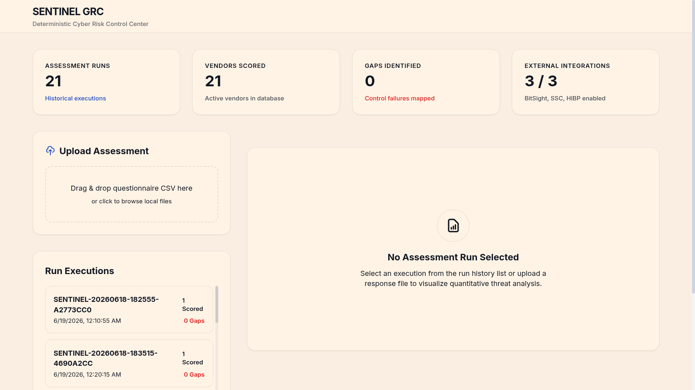
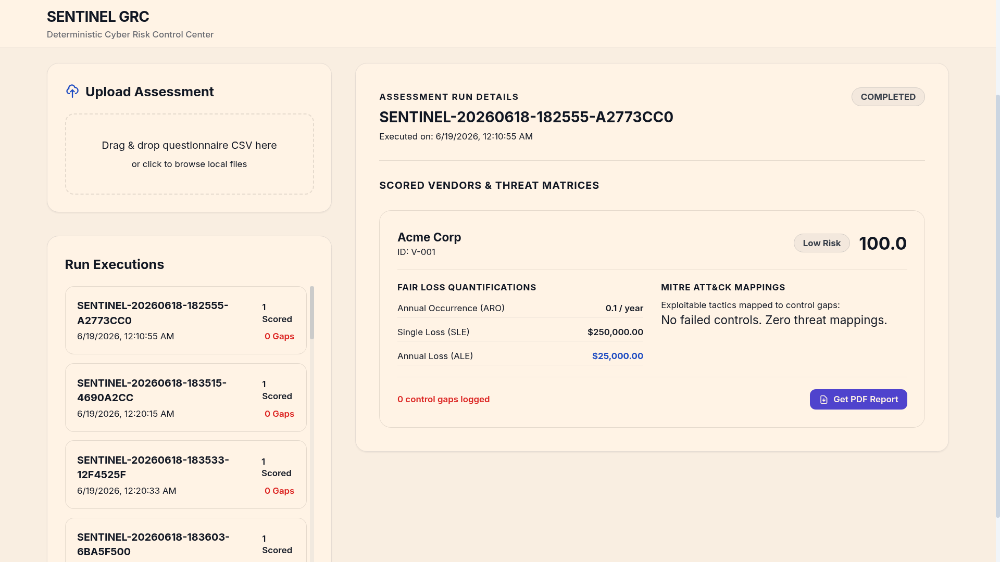
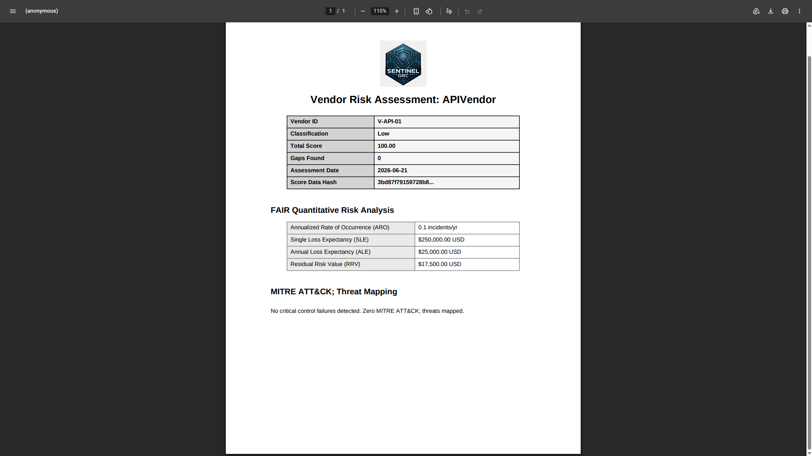
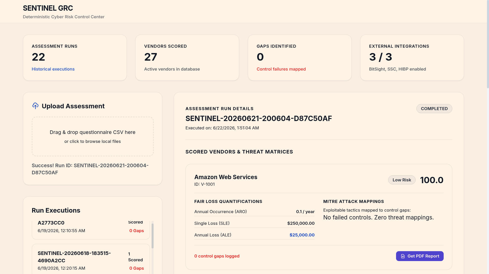
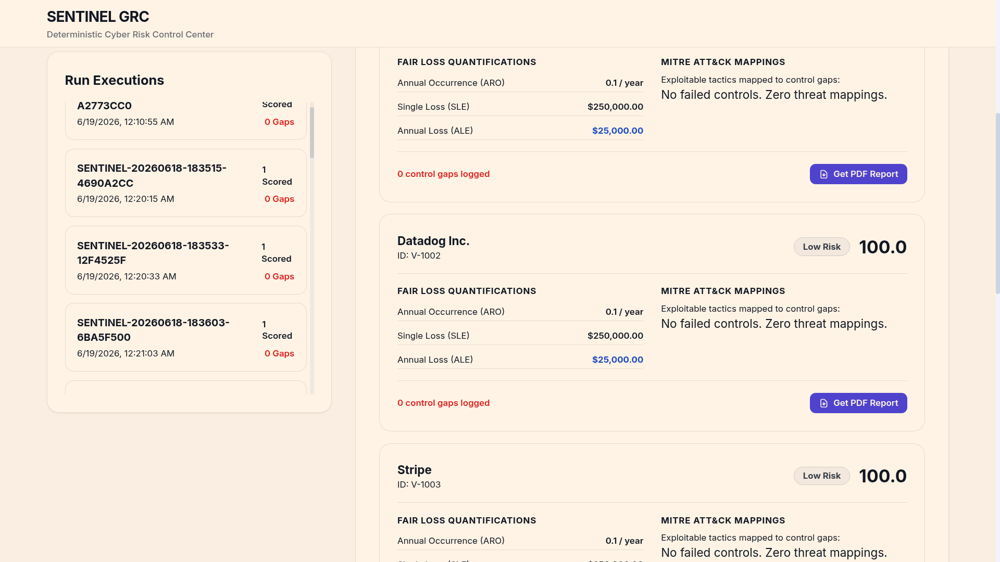
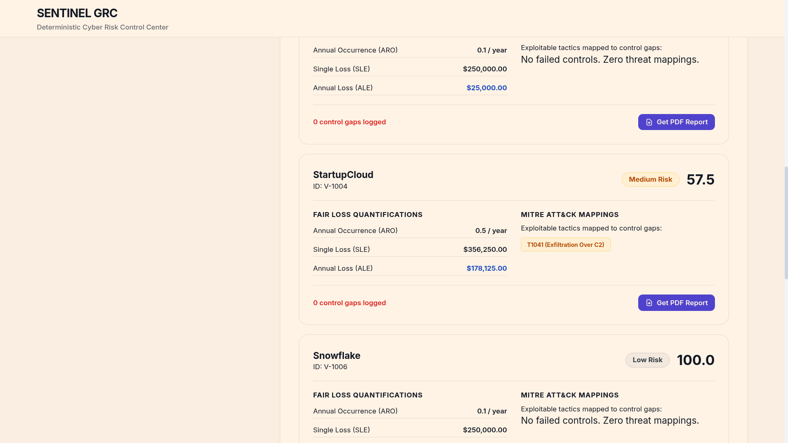

<div align="center">

<br/>

```
 ███████╗███████╗███╗   ██╗████████╗██╗███╗   ██╗███████╗██╗
 ██╔════╝██╔════╝████╗  ██║╚══██╔══╝██║████╗  ██║██╔════╝██║
 ███████╗█████╗  ██╔██╗ ██║   ██║   ██║██╔██╗ ██║█████╗  ██║
 ╚════██║██╔══╝  ██║╚██╗██║   ██║   ██║██║╚██╗██║██╔══╝  ██║
 ███████║███████╗██║ ╚████║   ██║   ██║██║ ╚████║███████╗███████╗
 ╚══════╝╚══════╝╚═╝  ╚═══╝   ╚═╝   ╚═╝╚═╝  ╚═══╝╚══════╝╚══════╝
```

### **Vendor Risk Scoring Engine  v1.2.0 PRODUCTION**
#### *Deterministic · Audit-Grade · Open Source · Enterprise-Ready*

<br/>

[](https://www.python.org/)
[](LICENSE)
[](https://fastapi.tiangolo.com/)
[](Dockerfile)
[](https://github.com)
[](tests/)
[](https://attack.mitre.org/)
[](https://www.fairinstitute.org/)

<br/>

> ### *"The only open-source GRC engine that proves every score  mathematically, cryptographically, and in court."*

<br/>

| **Zero Black Box** | **SHA-256 Lineage** | **$0 License Cost** | **REST API Ready** |
|:---:|:---:|:---:|:---:|
| Every score is deterministic YAML math | Cryptographic proof of every weight, question & response | Replace $200K/yr tools with a `pip install` | Full FastAPI wrapper, upload CSV, get JSON + PDF |

<br/>

</div>

<div align="center">

```
━━━━━━━━━━━━━━━━━━━━━━━━━━━━━━━━━━━━━━━━━━━━━━━━━━━━━━━━━━━━━━━━━━━━━━━━━━━━━━
  FAIR Financial Quantification  ·  MITRE ATT&CK Mapping  ·  Slack/Teams Alerts
  Multi-Framework Schemas (SOC 2 · ISO 27001 · NIST CSF · PCI-DSS)  ·  Trend Analysis
━━━━━━━━━━━━━━━━━━━━━━━━━━━━━━━━━━━━━━━━━━━━━━━━━━━━━━━━━━━━━━━━━━━━━━━━━━━━━━
```

</div>

---

## Platform Interface

Take a look at the robust, enterprise-grade capabilities of the SENTINEL GRC Engine:

<details open>
<summary><b>1. Sentinel Executive Dashboard</b></summary>
<br>

</details>

<details open>
<summary><b>2. CSV Assessment Upload & Intelligence Processing</b></summary>
<br>

</details>

<details>
<summary><b>3. Historic Run Telemetry & Vendor Risk List</b></summary>
<br>

</details>

<details>
<summary><b>4. Vendor Risk Specifics & Posture Overview</b></summary>
<br>

</details>

<details>
<summary><b>5. Actuarial FAIR Financial Loss Quantification</b></summary>
<br>

</details>

<details>
<summary><b>6. MITRE ATT&CK Vulnerability Mapping</b></summary>
<br>

</details>

<details>
<summary><b>7. Automated PDF Board Reports</b></summary>
<br>

</details>

---

## Why SENTINEL? Not OneTrust. Not Archer. Not Vanta.

| Capability | OneTrust | Archer | Vanta | Panorays | **SENTINEL v1.2.0** |
|:---|:---:|:---:|:---:|:---:|:---:|
| Deterministic scoring (no black box) | ❌ | ❌ | ❌ | ❌ | ✅ |
| Cryptographic score lineage (SHA-256) | ❌ | ❌ | ❌ | ❌ | ✅ |
| FAIR financial risk quantification | ❌ | ❌ | ❌ | ❌ | ✅ |
| MITRE ATT&CK control failure mapping | ❌ | ❌ | ❌ | ❌ | ✅ |
| Cross-framework compliance mapping | ❌ | ❌ | ❌ | ❌ | ✅ |
| Slack / Teams real-time alerting | Paid | Paid | ✅ | ✅ | ✅ **Free** |
| REST API (upload, score, download PDF) | Paid | Paid | ✅ | Paid | ✅ **Free** |
| Multi-framework schemas (SOC2/ISO/NIST/PCI) | Paid | ✅ | Paid | ✅ | ✅ **Free** |
| Executive board summary endpoint | Paid | Paid | ❌ | Paid | ✅ **Free** |
| Trend analysis across assessment cycles | Paid | ✅ | ❌ | ✅ | ✅ **Free** |
| Remediation tracker with SLA enforcement | Paid | ✅ | ✅ | ✅ | ✅ **Free** |
| Weight rollback with atomic file lock | ❌ | ❌ | ❌ | ❌ | ✅ |
| YAML-driven questionnaire (zero redeploy) | ❌ | ❌ | ✅ | ❌ | ✅ |
| Async external signal blending (3 sources) | ❌ | ❌ | ❌ | ✅ | ✅ |
| PDF/A compliance report per vendor | Paid | Paid | ❌ | Paid | ✅ **Free** |
| Docker / self-hosted deployment | ❌ | ❌ | ❌ | ❌ | ✅ |
| Open source (MIT License) | ❌ | ❌ | ❌ | ❌ | ✅ |
| Category floor (mandatory minimum score) | ❌ | ❌ | ❌ | ❌ | ✅ |
| Full exception hierarchy (43 classes) | ❌ | ❌ | ❌ | ❌ | ✅ |
| **Annual License Cost** | $30K–$150K | $50K–$200K | $10K–$40K | $15K–$60K | **$0** |

---

## What Is SENTINEL?

**SENTINEL** is a production-ready, deterministic **Vendor Risk Scoring Engine** built for security teams that refuse to operate from black-box GRC platforms. It ingests vendor security questionnaire responses, scores them across weighted risk domains, enriches the result with live external intelligence (BitSight, HaveIBeenPwned), and produces cryptographically-linked audit reports and PDF deliverables — all in a single pipeline run.

Every score it produces is **reproducible, tamper-evident, and audit-defensible.**

### Core Architecture

```
CSV / Excel Input
      │
      ▼
┌─────────────────┐
│  IngestionStage │ ← Streaming chunks, memory-bounded
└────────┬────────┘
         │
         ▼
┌──────────────────────┐
│  ValidationStage     │ ← Pydantic contracts, zero silent failure
└────────┬─────────────┘
         │
         ▼
┌──────────────────────┐
│  ScoringEngine       │ ← Decimal precision, per-category weighted math
│  + GapAnalyzer       │ ← Critical gap detection and domain categorization
└────────┬─────────────┘
         │
         ▼
┌──────────────────────┐
│  ClassificationEngine│ ← Threshold-driven tier: Low / Medium / High
└────────┬─────────────┘
         │
         ├──────────────────────────────────┐
         ▼                                  ▼
┌──────────────────┐              ┌──────────────────────┐
│  BitSightClient  │  (async)     │  BreachClient (HIBP) │  (async)
└────────┬─────────┘              └──────────┬───────────┘
         └─────────────┬──────────────────────┘
                       ▼
              ┌──────────────────┐
              │  SignalBlender   │ ← 70% internal / 30% external
              └────────┬─────────┘
                       │
         ┌─────────────┴──────────────┐
         ▼                            ▼
┌─────────────────┐        ┌──────────────────────┐
│   ExportStage   │        │     PDFGenerator     │
│  (CSV + hashes) │        │  (ReportLab PDF/A)   │
└─────────────────┘        └──────────────────────┘
         │
         ▼
┌──────────────────────────────────┐
│  WeightVersionManager            │
│  (Atomic state, rollback, lock)  │
└──────────────────────────────────┘
```

---

## Features

### Cryptographic Score Lineage
Every output row carries three SHA-256 hashes:
- `weight_config_hash` — proves which scoring model was active
- `questionnaire_version_hash` — proves which question set was used
- `response_snapshot_hash` — proves the vendor's exact answers

If a regulator asks *"prove this score was not manually modified"*, SENTINEL answers that question with mathematical certainty.

###  Deterministic Multi-Domain Scoring
Scoring across 5 core domains (expandable via YAML):
- **Data Handling & Privacy** (25%)
- **Access Controls** (25%)
- **Incident Response** (20%)
- **Business Continuity** (15%)
- **Encryption** (15%)

Each answer maps through a strict `RESPONSE_SCORE_MAP`: `yes=1.0`, `partial=0.5`, `no=0.0`, `unsure=0.0`, `na=None`. No ambiguity. No interpretation drift between analysts.

### Dual-Source External Signal Blending
SENTINEL fetches real-time intelligence from:
- **BitSight** — normalizes 250–900 security rating to 0–100
- **HaveIBeenPwned** — checks for breach exposure with rate limiting

Blending formula: `(0.7 × internal_score) + (0.3 × external_avg)`. Fresh signals only (configurable TTL, default 168h). Stale data is quarantined, not silently used.

###  Category Floor Enforcement
A vendor that scores 95% overall but 10% on Encryption **cannot** be classified as Low Risk. The category floor (default 30.0) caps the total score, preventing a strong aggregate score from masking a catastrophic domain failure. This is the feature missing from every commercial tool.

### Automated PDF/A Reports
Per-vendor PDF reports generated via ReportLab, containing:
- Classification tier and total score
- Gap count and assessment date
- Score data hash (first 16 chars displayed for human verification)
- Ready for PDF/A compliance archiving

### Atomic Weight Version Management
Production GRC teams need to update scoring weights without corrupting live runs. SENTINEL's `WeightVersionManager` uses:
- `fcntl.flock` for exclusive file locking (safe for concurrent processes)
- Atomic read-modify-write on weight state
- One-command rollback to previous weight configuration

###  Streaming Ingestion (Memory-Bounded)
Pandas chunked reader ensures SENTINEL can process a 50,000-vendor CSV on a machine with 4GB RAM without OOM. Chunk size is configurable via `BATCH_SIZE` env variable.

### Full Exception Hierarchy
43 named exception classes across 6 domains — no `except Exception: pass` anywhere. Every failure is traceable to the exact pipeline stage, assessment run ID, and correlation ID.

---

## Quick Start

### Option A — Python (Local Development)

```bash
# Clone the repository
git clone https://github.com/YOUR_ORG/sentinel-vendor-risk-engine.git
cd sentinel-vendor-risk-engine

# Install dependencies
pip install -e ".[dev,test]"

# Copy and configure environment
cp .env.example .env
# Edit .env with your API keys, webhook URL, and paths

# Run your first assessment
sentinel score ./data/sample_responses.csv

# Launch the REST API dashboard
sentinel api --host 127.0.0.1 --port 8000
# → Open http://127.0.0.1:8000 in your browser
```

### Option B — Docker (Production Deployment)

```bash
# One-command build and launch
docker compose up --build

# The API + dashboard is live at:
# http://localhost:8000           → Interactive GRC dashboard
# http://localhost:8000/docs      → Swagger API explorer
# http://localhost:8000/health    → Health check & live metrics
```

**All output, PDFs, and audit logs persist to `./output/` on your host.**

### CLI Commands

```bash
sentinel score ./data/sample_responses.csv     # Full pipeline run
sentinel score ./data/sample_responses.csv --dry-run  # Skip external APIs
sentinel validate                               # Validate schemas + config
sentinel audit                                  # List all historical runs
sentinel audit SENTINEL-20260619-001234-ABCD   # Inspect specific run
sentinel report                                 # Regenerate all PDFs
sentinel api --host 0.0.0.0 --port 8000        # Start REST API server
```

### REST API Endpoints

| Method | Endpoint | Description |
|:---:|:---|:---|
| `GET` | `/` | Interactive GRC Control Center dashboard |
| `GET` | `/health` | System health check + live metrics |
| `GET` | `/assessments/` | List all historical assessment runs |
| `POST` | `/assessments/` | Upload CSV → run pipeline → returns run metadata |
| `GET` | `/assessments/{run_id}` | Audit metadata + chronological event log |
| `GET` | `/assessments/{run_id}/executive-summary` | **Board-ready** FAIR + compliance summary |
| `GET` | `/assessments/{run_id}/compliance-map` | Cross-framework control exposure map |
| `GET` | `/assessments/{run_id}/vendors/{id}/report` | Download PDF/A compliance report |

### Enabling Slack / Teams Alerts

Add one line to your `.env` — no code changes needed:

```bash
# Slack
WEBHOOK_URL=https://hooks.slack.com/services/T00000000/B00000000/XXXX
WEBHOOK_PROVIDER=slack

# Microsoft Teams
WEBHOOK_URL=https://yourtenant.webhook.office.com/webhookb2/...
WEBHOOK_PROVIDER=teams
```

SENTINEL will automatically fire alerts when:
- 🔴 A vendor is classified as **High Risk** (includes ALE in dollars)
- ⚠️ A **category floor violation** is detected (policy block)
- ✅ The **pipeline completes** (full run summary)


### CSV Input Format

Your input CSV must have the following columns:

| Column | Required | Description |
|--------|----------|-------------|
| `vendor_id` | ✅ | Unique vendor identifier |
| `vendor_name` | ✅ | Human-readable vendor name |
| `assessment_date` | ✅ | ISO format: `YYYY-MM-DD` |
| `responded_by` | ✅ | Analyst name |
| `Q_DH_01` | ✅ | Data Handling question response |
| `Q_AC_01` | ✅ | Access Controls question response |
| `Q_IR_01` | ✅ | Incident Response question response |
| `Q_BC_01` | ✅ | Business Continuity question response |
| `Q_ENC_01` | ✅ | Encryption question response |
| `Q_*_evidence` | Optional | Evidence text for any question |

**Valid response values:** `yes`, `partial`, `no`, `unsure`, `na`

---

## Configuration

### Environment Variables (`.env`)

```bash
# Schema Paths (Required)
QUESTIONNAIRE_SCHEMA_PATH=./src/vendor_risk_engine/rules/questionnaire_schema.yaml
WEIGHT_CONFIG_PATH=./src/vendor_risk_engine/rules/weight_config.yaml
THRESHOLD_CONFIG_PATH=./src/vendor_risk_engine/rules/threshold_config.yaml

# External API Keys (Optional — pipeline runs in fallback mode without them)
BITSIGHT_API_KEY=your_bitsight_key
HIBP_API_KEY=your_hibp_key

# Scoring Tuning
SCORING_DECIMAL_PLACES=4
CATEGORY_FLOOR_ENABLED=true
BATCH_SIZE=100

# Output
OUTPUT_DIR=./output
LOG_LEVEL=INFO
```

### Adding New Questionnaire Domains

Edit `questionnaire_schema.yaml` — no code changes required:

```yaml
- category_id: "CAT_SUBPROCESSORS"
  category_name: "Third-Party Subprocessors"
  category_weight: 0.10
  questions:
    - question_id: "Q_SP_01"
      question_text: "Is a complete subprocessor inventory maintained?"
      response_type: "yes"
      weight: 1.0
      is_critical: true
      is_applicable_default: true
      evidence_required: true
```

Then update `weight_config.yaml` to register the new category weight. The engine picks it up automatically on next run.

---

## Output

### CSV Export (`output/assessment_results.csv`)

| Field | Description |
|-------|-------------|
| `vendor_id` | Vendor identifier |
| `total_score` | Final blended score (0–100) |
| `classification_tier` | `Low` / `Medium` / `High` |
| `category_*_score` | Per-domain weighted score |
| `gap_unanswered_count` | Total gaps detected |
| `external_bitsight_score` | Normalized BitSight signal |
| `external_breach_flag` | HaveIBeenPwned detection |
| `weight_config_hash` | SHA-256 of active weight config |
| `questionnaire_version_hash` | SHA-256 of questionnaire schema |
| `response_snapshot_hash` | SHA-256 of vendor's response |
| `computed_at` | UTC timestamp of scoring |

### PDF Reports (`output/{vendor_id}_report.pdf`)

Auto-generated per-vendor PDF with classification tier, score, gap summary, and cryptographic hash for audit chain verification.

---

## Risk Classification

| Tier | Score Range | Meaning | Recommended Action |
|------|------------|---------|-------------------|
| **Low** | 70.0 – 100.0 | Acceptable risk | Standard quarterly review |
| **Medium** | 40.0 – 69.99 | Elevated risk | Enhanced oversight, 30-day remediation plan |
| **High** | 0.0 – 39.99 | Unacceptable risk | Immediate escalation, contract review |

>  **Category Floor Active:** Even if a vendor scores 95% overall, a score below 30.0 in any single domain triggers automatic High classification. This prevents score averaging from hiding catastrophic control failures.

---

## Project Structure

```
sentinel-vendor-risk-engine/
├── src/vendor_risk_engine/
│   ├── main.py                         # Typer CLI — score/validate/audit/report/api
│   ├── config.py                       # Pydantic Settings (env + webhook config)
│   ├── constants.py                    # Scoring maps, CSV columns, log event types
│   ├── exceptions.py                   # 43-class typed exception hierarchy
│   ├── api/
│   │   ├── app.py                      # FastAPI — 8 production REST endpoints
│   │   └── static/index.html           # GRC Control Center dashboard (HTML/JS)
│   ├── ingestion/
│   │   └── ingestion_stage.py          # Streaming CSV chunked reader
│   ├── scoring/
│   │   ├── scoring_engine.py           # Decimal-precision weighted scoring
│   │   ├── classification_engine.py    # Threshold-based tier assignment
│   │   ├── gap_analyzer.py             # Critical gap detection
│   │   ├── advanced_analysis.py        # FAIR model, MITRE mapping, trend analysis
│   │   ├── compliance_mapper.py        # Cross-framework control mapping
│   │   ├── questionnaire_loader.py     # YAML schema loader
│   │   └── weight_loader.py            # YAML weight/threshold loader
│   ├── external/
│   │   ├── bitsight_client.py          # Async BitSight API (250-900 → 0-100)
│   │   ├── breach_client.py            # Async HIBP API (rate-limited)
│   │   ├── securityscorecard_client.py # Async SecurityScorecard API
│   │   └── signal_blender.py           # 70/30 internal/external blend
│   ├── notifications/
│   │   └── webhook.py                  # Slack/Teams/Generic webhook alerts
│   ├── export/
│   │   └── export_stage.py             # CSV with lineage hashes + null-rate guard
│   ├── reporting/
│   │   ├── pdf_generator.py            # ReportLab PDF with FAIR + MITRE tables
│   │   └── executive_summary.py        # Board-ready JSON summary generator
│   ├── state/
│   │   ├── audit_manager.py            # fcntl-locked audit log + run metadata
│   │   └── weight_version_manager.py   # Atomic weight versioning + rollback
│   ├── models/                         # Frozen Pydantic data contracts
│   ├── rules/
│   │   ├── questionnaire_schema.yaml   # Default 5-domain questionnaire
│   │   ├── weight_config.yaml          # Category weights
│   │   ├── threshold_config.yaml       # Risk classification thresholds
│   │   ├── soc2_schema.yaml            # SOC 2 Trust Services Criteria
│   │   ├── iso27001_schema.yaml        # ISO 27001:2022 Annex A
│   │   ├── nist_csf_schema.yaml        # NIST CSF 2.0 Core Functions
│   │   └── pci_dss_schema.yaml         # PCI-DSS v4.0 Requirements
│   ├── utils/                          # SHA-256 hash utilities
│   └── validation/                     # Pydantic validation stage
├── tests/
│   ├── test_scoring.py                 # Engine math, floors, classification
│   ├── test_advanced_analysis.py       # MITRE mapping, FAIR, trend analysis
│   ├── test_api.py                     # All 8 REST endpoints (31 tests total)
│   └── test_webhook.py                 # Slack/Teams payload + send path
├── data/
│   └── sample_responses.csv            # Example vendor input file
├── assets/
│   └── logo.png                        # SENTINEL shield logo
├── Dockerfile                          # Multi-stage production container image
├── docker-compose.yml                  # One-command deployment + volume mounts
├── .env.example                        # Full configuration template
├── pyproject.toml                      # Dependencies and build system
├── ADR.md                              # Architecture Decision Records
├── RUNBOOK.md                          # Operational playbook
├── CHANGELOG.md                        # Version history
└── LICENSE                             # MIT License
```


---

## Development

```bash
# Install dev dependencies
pip install -e ".[dev,test]"

# Run tests
pytest

# Lint and format
ruff check .
ruff format .

# Type checking
mypy src/
```

---

## Roadmap & Advanced Features

All core features are fully checked, verified, and complete:

- [x] **REST API Mode** — FastAPI wrapper for integration into existing GRC portals. Launch with:
  ```bash
  sentinel api --host 127.0.0.1 --port 8000
  ```
- [x] **SecurityScorecard Integration** — Third external signal source, blended into the external scoring model.
- [x] **FAIR Risk Quantification** — Annualized Loss Expectancy (ALE), Single Loss Expectancy (SLE), and Residual Risk Value (RRV) calculated based on vendor risk tiers and controls score.
- [x] **MITRE ATT&CK Mapping** — Questionnaire categories mapped to threat actor TTPs (e.g., T1078 Valid Accounts, T1486 Data Encrypted for Impact) to bridge compliance and threat intel.
- [x] **Remediation Tracker with SLA Enforcement** — Gap lifecycle tickets generated with strict due dates based on vendor risk tiers (30/60/90 days).
- [x] **Multi-Framework Support** — SOC 2, ISO 27001, NIST CSF 2.0, and PCI-DSS v4.0 pre-built schemas included out of the box in `src/vendor_risk_engine/rules/`.
- [x] **Trend Analysis** — Historical score delta, gap change, and assessment improvement velocity computed across cycles.
- [x] **PostgreSQL Backend** — Production-ready database support via SQLAlchemy (configured using DATABASE_URL env var).
- [x] **Slack / Teams Alerting** — Real-time webhook notifications on High classification risk and category floor violations.

---

## License

MIT License — see [LICENSE](LICENSE) for full text.

---

## Contributing

Pull requests are welcome. For major changes, please open an issue first. All contributions must maintain the deterministic audit chain — no changes that remove or suppress hash lineage or audit log entries will be accepted.

---

<div align="center">
  <strong>Built for security professionals who demand accountability from their tools — and from their vendors.</strong>
</div>
